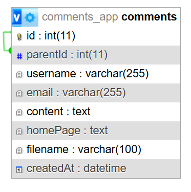

# Comments Application

Это серверное приложение на Node.js позволяет пользователям оставлять комментарии, загружать вложения, а также предоставляет API для взаимодействия с фронтендом. Приложение использует MySQL для хранения данных и Socket.IO для отображения количества пользователей онлайн в реальном времени.

## Содержание

- [Функциональные возможности](#функциональные-возможности)
- [Установка и запуск](#установка-и-запуск)
- [Технологии](#технологии)
- [Структура проекта](#структура-проекта)
- [API](#api)
- [Клиентская часть](#клиентская-часть)


## Функциональные возможности

- Добавление комментариев с возможностью вложения файлов (изображения или текстовые файлы).
- Валидация данных перед сохранением комментария (защита от XSS, проверка форматов E-mail и URL).
- Поддержка вложенных комментариев (ответы на комментарии).
- Сохранение и получение файлов, загруженных вместе с комментариями.
- Реальное время: отслеживание количества пользователей онлайн с помощью WebSocket.
- Защита от автоматических запросов с использованием CAPTCHA.

## Установка и запуск

### I. Обычная установка

#### 1. Установка зависимостей

```
npm install
```
#### 2. Настройка переменных окружения

**Добавьте переменные окружения в файл `.env`:**

  ```
  DB_NAME=your_database_name
  DB_USER=your_database_user
  DB_PASSWORD=your_database_password
  DB_HOST=your_host_address
  CORS_ORIGIN=client
  SESSION_SECRET=your_session_secret
  PORT=3000
  ```

Замените значения на соответствующие для ваших настроек.


#### 3. Настройка базы данных




#### База данных

- **Имя базы данных:** `comments_app`
- **Кодировка:** `utf8mb4`
- **Сравнение:** `utf8mb4_unicode_ci`

#### Таблица `comments`

- **id** (INT, AUTO_INCREMENT, PRIMARY KEY) - Уникальный идентификатор комментария.
- **username** (VARCHAR(255), NOT NULL) - Имя пользователя.
- **email** (VARCHAR(255), NOT NULL) - Электронная почта пользователя.
- **content** (TEXT, NOT NULL) - Содержание комментария.
- **filename** (TEXT) - Имя файла-вложения (опционально).
- **homepage** (TEXT) - URL домашней страницы пользователя (опционально).
- **createdAt** (DATETIME, NOT NULL, DEFAULT CURRENT_TIMESTAMP) - Дата и время создания комментария.
- **parentId** (INT) - Идентификатор родительского комментария (опционально, внешний ключ).

#### Индексы

- **idx_parentId** - Индекс по полю `parentId`.

#### Внешний ключ

- **fk_parentId** - Ссылка на поле `id` в той же таблице `comments`, с каскадным удалением.

> **Примечание:** Используйте файл `init.sql` для создания базы данных и заполнения тестовыми данными.


#### 4. Запуск приложения
Запуск сервера
```
npm start
```

Запуск сервера с использованием `nodemon` для автоматического перезапуска
```
npm run dev
```

### II. Установка и запуск с использованием Docker

Запустите приложение с использованием Docker Compose:

```
docker-compose up --build
```

Соберет контейнеры, используя Dockerfile для приложения и образ MySQL для базы данных.
База данных будет заполнена тестовыми данными.

После успешного запуска приложение будет доступно по адресу http://localhost:3000.

## Технологии

- **Node.js** - Основная серверная платформа.
- **Express.js** - Фреймворк для создания веб-приложений на Node.js.
- **Sequelize** - ORM для взаимодействия с базой данных MySQL.
- **Socket.IO** - Для обработки и управления WebSocket-соединениями.
- **Multer** - Для обработки загрузки файлов.
- **XSS** - Для защиты от XSS-атак.
- **svg-captcha** - Для генерации CAPTCHA.

## Структура проекта

### Основные папки и файлы

- **`config/`** - Конфигурационные файлы приложения
  - `database.js` - Конфигурация базы данных с использованием Sequelize
  - `socket.js` - Настройка и конфигурация WebSocket-сервера

- **`controllers/`** - Логика обработки маршрутов
  - `comment.controller.js` - Обработка запросов, связанных с комментариями

- **`middleware/`** - Пользовательские middleware для валидации и защиты
  - `securityValidator.js` - Валидация входных данных и защита от XSS-атак
  - `uploader.js` - Настройка и обработка загрузки файлов

- **`models/`** - Модели данных для работы с базой данных
  - `comment.js` - Модель комментария, используемая в базе данных

- **`routes/`** - Определение маршрутов
  - `comment.routes.js` - Маршруты для работы с комментариями
  - `file.routes.js` - Маршруты для работы с файлами
  - `security.routes.js` - Маршруты связанные с обеспечением безопасности
  - `validation.routes.js` - Маршруты для валидации данных

- **`services/`** - Сервисы и вспомогательные функции
  - `captcha.js` - Генерация и верификация CAPTCHA
  - `SocketManager.js` - Управление WebSocket-соединениями

- **`fileStorage/commentsUploads`** - Директория для хранения загружаемых файлов

## API

Приложение взаимодействует с фронтендом через следующие API:

## GET /api/comments

**Описание:**
Возвращает список всех комментариев, включая вложенные комментарии (ответы).

**Контроллер:**
- **Метод:** `commentController.getComments`
- **Действие:** Запрашивает все комментарии из базы данных, включая их вложенные ответы, и возвращает их в виде дерева комментариев.

**Ответ:**
- **200 OK:** Возвращает JSON массив комментариев с их вложенными ответами.

```
[
  {
    "id": 1,
    "username": "JohnDoe",
    "email": "john@example.com",
    "content": "This is a comment.",
    "filename": null,
    "homepage": "https://example.com",
    "createdAt": "2023-08-01T10:00:00Z",
    "parentId": null,
    "replies": [
      {
        "id": 2,
        "username": "JaneDoe",
        "email": "jane@example.com",
        "content": "This is a reply.",
        "filename": null,
        "homepage": null,
        "createdAt": "2023-08-01T11:00:00Z",
        "parentId": 1,
        "replies": []
      }
    ]
  }
]
```


## POST /api/comment

**Описание:**
Добавляет новый комментарий в базу данных. Поддерживает вложенные комментарии и загрузку файлов (изображений или текстовых файлов) вместе с комментарием.

**Контроллер:**

- **Метод:** `commentController.addComment`
- **Действие:** Получает данные комментария из тела запроса, проверяет их с помощью middleware и сохраняет комментарий в базе данных. Если был загружен файл, он также сохраняется на сервере.

**Параметры:**

- `username` (строка, обязательное): Имя пользователя, оставляющего комментарий.
- `email` (строка, обязательное): Email пользователя.
- `content` (строка, обязательное): Текст комментария.
- `parentId` (число, опционально): Идентификатор родительского комментария, если это ответ.
- `homepage` (строка, опционально): Домашняя страница пользователя.
- `file` (файл, опционально): Вложение (изображение или текстовый файл).

**Ответ:**

- **200 OK:** Возвращает JSON объект с данными созданного комментария.

```json
{
  "id": 3,
  "username": "JohnDoe",
  "email": "john@example.com",
  "content": "This is another comment.",
  "filename": "example.png",
  "homepage": "https://example.com",
  "createdAt": "2023-08-01T12:00:00Z",
  "parentId": null
}
```

## POST /api/validate/comment

**Описание:**
Выполняет валидацию данных комментария перед их добавлением. Включает проверку на наличие XSS-атак, правильность формата E-mail и URL.

**Контроллер:**

- **Метод:** `commentController.validateComment`
- **Действие:** Использует middleware для проверки данных комментария. 

**Параметры:**

- `username` (строка, обязательное): Имя пользователя.
- `email` (строка, обязательное): Email пользователя.
- `content` (строка, обязательное): Текст комментария.
- `homepage` (строка, опционально): Домашняя страница пользователя.

**Ответ:**

- **200 OK:** Если валидация успешна.

```
{
  "valid": true,
  "message": "Validation complete"
}
```

## GET /api/commentFile/

**Описание:**
Получение файла-вложения, связанного с комментарием.

**Контроллер:**

- **Метод:** `commentController.getCommentFile`
- **Действие:** Ищет и возвращает файл по указанному имени (`filename`).

**Параметры:**

- `filename` (строка, обязательное): Имя файла, который нужно получить.

**Ответ:**

- **200 OK:** Возвращает содержимое файла (например, изображение или текстовый файл).
- **404 Not Found:** Если файл не найден.


## GET /api/captcha

**Описание:**
Генерирует и возвращает изображение CAPTCHA в формате SVG.

**Контроллер:**

- **Метод:** `captcha.generateCaptcha`
- **Действие:** Генерирует CAPTCHA, сохраняет её текст в сессии пользователя.

**Ответ:**

- **200 OK:** Возвращает SVG-изображение CAPTCHA.


## POST /api/verifyCaptcha

**Описание:**
Проверяет введенную пользователем CAPTCHA на соответствие с сохраненной в сессии.

**Контроллер:**

- **Метод:** `captcha.verifyCaptcha`
- **Действие:** Сравнивает текст, введенный пользователем, с текстом CAPTCHA, сохраненным в сессии.

**Параметры:**

- `captcha` (строка, обязательное): Текст CAPTCHA, введенный пользователем.

**Ответ:**

- **200 OK:** Если CAPTCHA введена правильно.

```
{
  "verified": true
}
```

- **400 Bad Request:** Если CAPTCHA введена неверно.
```
{
  "verified": false,
  "message": "CAPTCHA неверная, попробуйте снова."
}
```

## Клиентская часть

Статический клиентский код помещается в директорию `client` в корне приложения.

Исходный код приложения клиента, разработанного на React, доступен в репозитории по  [ссылке](https://github.com/ValentynaKoriahina/comments-client).


